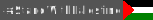

# Stand with Palestine  🇵🇸

### SVG Badges to show support for our LOVELY Palestine  🇵🇸

## Profile Picture "IStandWithPalestine" Preview

  

 

## Badges "IStandWithPalestine, IStandWithPalestine, WeStandWithPalestine, MadeInPalestine" Light/ Dark previews

  
  
  
  

  
  
  
  

  
  
  
  

  
  
  
  

<h4> P. S. use Light theme to see "Light" badges, use Dark theme to see "Dark" & "Bordered" badges </h4>

### [Contributing](CONTRIBUTING.md)
